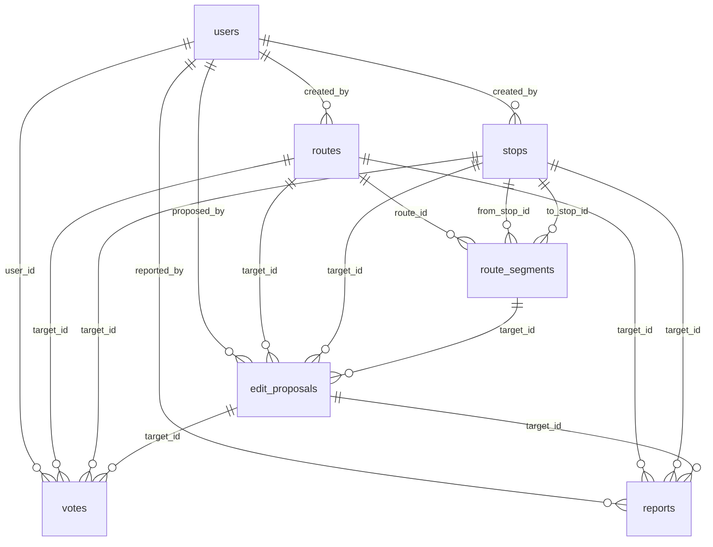
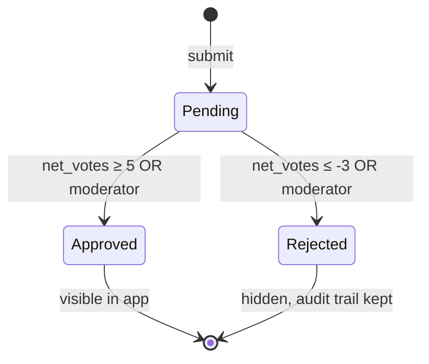

# Data Model Overview

#entity #doc

← [[Home]]

---

## Entity Map

---

## Entities

| Entity | Purpose |
|--------|---------|
| [[users]] | Identity, reputation |
| [[routes]] | Transit route definitions |
| [[stops]] | Geocoded transit stops |
| [[route_segments]] | Ordered legs within a route |
| [[edit_proposals]] | Pending field-level corrections |
| [[votes]] | Upvote/downvote → moderation triggers |
| [[reports]] | Flags for moderator review |

---

## Moderation State Machine

Applies to: [[routes]], [[stops]], [[edit_proposals]]

---

## Offline Cacheability

| Entity | Strategy | TTL |
|--------|----------|-----|
| `routes` (approved) | Cache on view | 24h |
| `stops` | Cache on view + with route | 24h |
| `route_segments` | Always with parent route | 24h |
| `votes` | Write-through; queue offline | reconnect |
| `edit_proposals` | Read: cache recent | reconnect |
| `reports` | Write-only; queue offline | reconnect |
| `users` | Cache own; others on demand | — |

See [[09 Offline PWA]] for implementation.
