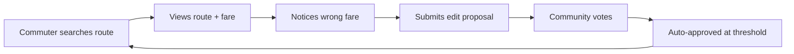

# Product Vision

#doc

← [[Home]]

---

## Problem

Metro Manila commuters navigate complex informal transit networks (jeepneys, UV Express, P2P buses) with no reliable digital route data. Official sources are sparse or outdated.

---

## Solution

Community-maintained transit map. Commuters submit, verify, and correct route data. Crowd-sourced, vote-moderated, offline-ready.

---

## Target User

Metro Manila daily commuter. Uses jeepneys, buses, MRT. Needs reliable "how do I get from A to B" answers, including fare estimates.

---

## Differentiator

- Community-verified data (not static official data)
- Covers informal modes (jeepneys, UV Express) official apps ignore
- Works offline mid-commute

---

## Core Loop

---

## Related

[[MVP Scope]] · [[Roadmap]] · [[Data Model Overview]] · [[07 Voting & Moderation]]
