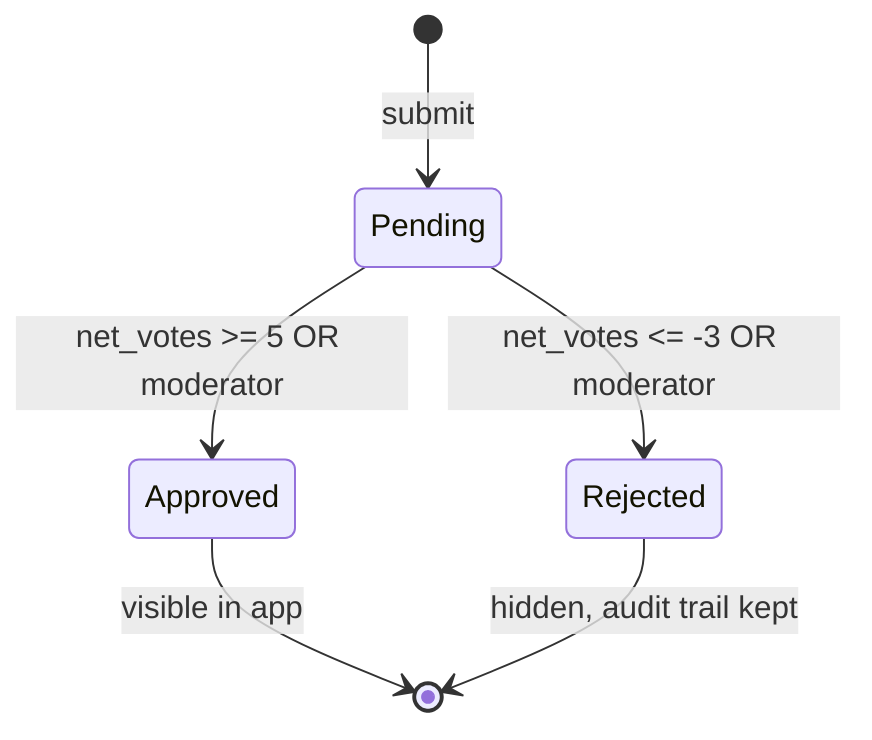

# Module 7 — Voting & Moderation

#module

**Purpose:** Crowd verification of contributions. Threshold-based auto-decisions.

← [[Home]]

---

## Status

All requirements **not started**.

| Requirement | Done? |
|-------------|-------|
| Schema: `votes` table | ❌ |
| Upvote / downvote on routes | ❌ |
| Vote toggle on second tap | ❌ |
| Postgres trigger: `net_votes >= 5` auto-approve | ❌ |
| Postgres trigger: `net_votes <= -3` auto-reject | ❌ |
| Pending badge on route/stop detail | ❌ |
| Flag content with reason | ❌ |
| `reports` table | ❌ |
| "My Submissions" / contribution status view | ❌ |

---

## Moderation State Machine

---

## Thresholds (configurable)

| Signal | Threshold |
|--------|-----------|
| Auto-approve | `net_votes >= 5` |
| Auto-reject | `net_votes <= -3` |

These are app config, not hardcoded — start conservative.

---

## Data Entities

- [[votes]] — one row per user per target; unique `(user_id, target_type, target_id)`
- [[reports]] — flag reason enum: `wrong_fare`, `outdated`, `duplicate`, `spam`, `other`

Targets: [[routes]], [[stops]], [[edit_proposals]]

---

## Moderator Flow (MVP)

Moderator reviews via Supabase dashboard — no in-app UI for MVP.

---

## Open Questions

- In-app moderator queue? — post-MVP
- Pending content visible to high-rep users only or everyone?

---

## Related

[[votes]] · [[reports]] · [[routes]] · [[stops]] · [[edit_proposals]] · [[03 Profile & Reputation]] · [[08 Edit Proposals]]
